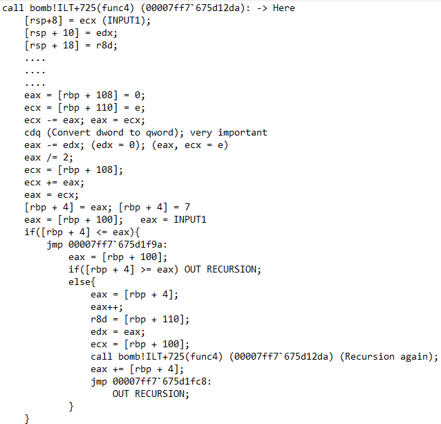
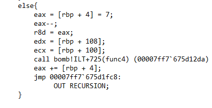

# Phase 4: Recursion (Đệ quy)

## 1. Đọc dữ liệu và Điều kiện cơ bản
Đầu tiên, chương trình đọc dữ liệu đầu vào với định dạng quen thuộc `"%d %d"`. Nếu bạn nhập sai số lượng, bom sẽ nổ.
Tiếp theo, chương trình kiểm tra Input 1 (lưu tại `[rbp + 4]`). Điều kiện để đi tiếp là Input 1 phải nằm trong khoảng **từ 0 đến 14** (hệ Hex là `0x0E`).

## 2. Tìm Input 2 và Mục tiêu của hàm đệ quy
Sau khi gọi hàm đệ quy `func4`, chương trình lấy giá trị trả về của hàm này đem so sánh với con số cố định `0x0A` (tức là **10**). Nếu khác 10 $\rightarrow$ BOMB. 
Thú vị hơn, nếu hàm trả về đúng 10, chương trình lại lôi Input 2 (lưu tại `[rbp + 24]`) ra so sánh tiếp với chính số 10 này. 
=> **Chốt hạ:** Input 2 chắc chắn là **10**, và mục tiêu của ta là tìm Input 1 sao cho hàm đệ quy trả về kết quả là **10**.

## 3. Giải mã Hàm Đệ quy (Binary Search)
Thay vì đọc Assembly thô, ta có thể dịch ngược (decompile) luồng chạy của hàm đệ quy `func4` ra mã giả (pseudocode) cho dễ nhìn như 2 ảnh dưới đây:

Khi bắt đầu chui vào hàm đệ quy `func4`, chương trình thiết lập 3 tham số khởi đầu:
* `rcx` = Input 1 của chúng ta (gán vào `[rsp+8]`).
* `edx` = 0 (biến `low`, gán vào `[rsp+10]`).
* `r8d` = 14 (biến `high`, gán vào `[rsp+18]`).

Tiếp theo là đoạn tính toán nhìn rất rối với lệnh `cdq`. CHILL! Lệnh `cdq` (Convert Doubleword to Quadword) - cdq sẽ dùng thanh ghi edx:eax, lệnh cdq sẽ kiểm tra giá trị eax bit trái cùng dương hay âm, nếu dương thì edx lấp đầy bằng 0, còn nếu âm thì edx được lấp đầy bởi F. Lấy cdq kết hợp với trừ (`eax -= edx`) và chia 2 (`eax /= 2`) chỉ là cách máy tính xử lý phép chia cho số âm để không bị sai số (bạn có thể chạy tay sẽ thấy cdq cứu phép toán này như thế nào :>).
Nếu gom toàn bộ cục tính toán này dịch ra công thức toán học, nó chỉ đơn giản là tìm điểm ở giữa (midpoint):
**`mid = low + (high - low) / 2`**

Kết quả của phép tính này (biến `mid`) được lưu vào `[rbp + 4]`. 

Sau khi có `mid`, chương trình đem nó so sánh với Input 1. Thuật toán này chính là **Tìm kiếm nhị phân (Binary Search)**. Điểm đặc biệt của `func4` trong bài này là: mỗi khi nó gọi đệ quy, giá trị trả về sẽ được **cộng dồn thêm với `mid`** (nhờ lệnh `eax += [rbp + 4]`).

## 4. Tracing (Dò ngược để tìm đáp án)
Nhắc lại mục tiêu: Tổng các giá trị `mid` cộng dồn sau khi thoát hết đệ quy phải bằng **10**.
Ta sẽ mô phỏng lại cách nó chạy:

*   **Lần chạy 1:** 
    * `low = 0`, `high = 14`.
    * Tính `mid = 0 + (14 - 0) / 2 = 7`.
    * Ta đang có tổng là 7. Để đạt mục tiêu 10, ta cần thiếu 3 nữa. Do đó, ta phải ép chương trình gọi đệ quy tiếp để tìm ra số 3. Vì 3 < 7, Input 1 bắt buộc phải nhỏ hơn `mid` để chương trình rẽ vào nhánh `high = mid - 1` (gọi đệ quy lần 2).

*   **Lần chạy 2:**
    * Nhánh mới có `low = 0`, `high = 7 - 1 = 6`.
    * Tính `mid = 0 + (6 - 0) / 2 = 3`.
    * Quá đẹp! Điểm `mid` lúc này đúng bằng 3. Lần chạy 1 trả về 7, lần chạy 2 trả về 3. Tổng cộng lại `7 + 3 = 10` đúng y chang mục tiêu.
    * Để thoát đệ quy ngay tại đây, Input 1 phải bằng đúng `mid`. Vậy Input 1 = 3.

👉 **Answer (Phase 4):** `3 10`
