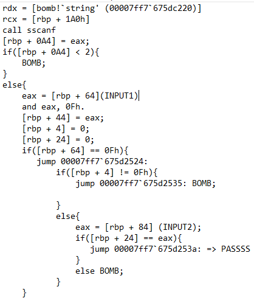
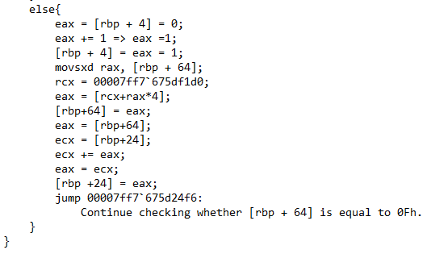
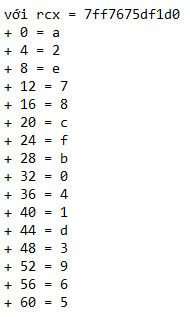

# Phase 5: Array Indexing & Linked List Traversal

## 1. Khởi tạo và Lọc Input
Đầu tiên, chương trình sử dụng `sscanf` để đọc 2 số nguyên từ người dùng. Nếu nhập thiếu, bom sẽ nổ ngay lập tức. 

Tiếp theo, chương trình lấy Input 1 (`[rbp + 64]`) và thực hiện phép toán bitwise `and eax, 0Fh`. Lệnh này có tác dụng xóa sạch các bit cao, chỉ giữ lại 4 bit thấp nhất của Input 1. Điều này ép Input 1 phải luôn là một con số nằm trong khoảng từ **0 đến 15**.
Chương trình cũng chuẩn bị sẵn 2 biến quan trọng và khởi tạo chúng bằng `0`:
*   `[rbp + 4]`: Đóng vai trò là biến đếm số vòng lặp (Counter).
*   `[rbp + 24]`: Đóng vai trò là biến lưu tổng cộng dồn (Accumulator).

## 2. Vòng lặp và Mảng dữ liệu bí mật
Cốt lõi của Phase 5 nằm ở một vòng lặp thao tác trực tiếp với bộ nhớ. Cứ mỗi lần lặp, nó làm các nhiệm vụ sau:
1.  Tăng biến đếm `[rbp + 4]` thêm 1 đơn vị (`eax += 1`).
2.  Dùng chính giá trị hiện tại của Input 1 làm Index (chỉ số) để móc ra một con số mới từ một mảng cố định nằm ở địa chỉ `rcx = 00007ff7'675df1d0` thông qua công thức `eax = [rcx + rax*4]`. 
3.  Con số mới tìm được này lại được nạp ngược vào `[rbp + 64]` để làm Index cho vòng lặp tiếp theo, tạo thành một chuỗi dây chuyền.
4.  Đồng thời, nó lấy con số mới này cộng dồn vào tổng `[rbp + 24]` (`ecx += eax`).

Nhờ việc soi vùng nhớ `rcx`, ta đã trích xuất được trọn vẹn 16 phần tử của mảng bí mật này. Quy đổi các giá trị từ hệ Hex sang hệ Thập phân để dễ tính toán, ta có bảng tra cứu sau:
* `+ 0 = 10` (a)
* `+ 4 = 2`
* `+ 8 = 14` (e)
* `+ 12 = 7`
* `+ 16 = 8`
* `+ 20 = 12` (c)
* `+ 24 = 15` (f)
* `+ 28 = 11` (b)
* `+ 32 = 0`
* `+ 36 = 4`
* `+ 40 = 1`
* `+ 44 = 13` (d)
* `+ 48 = 3`
* `+ 52 = 9`
* `+ 56 = 6`
* `+ 60 = 5`

## 3. Điều kiện thoát và Kỹ thuật Trace Back
Chương trình sẽ tự động ngắt vòng lặp khi con số vừa tìm được trong mảng bằng `0xF` (tức là **15**). Sau khi thoát, nó tiến hành kiểm tra 2 lớp bảo mật chốt hạ:
1.  **Kiểm tra độ dài chuỗi lặp:** `if([rbp + 4] != 0Fh) BOMB`. Điều kiện này ép buộc vòng lặp phải chạy đúng **15 lần**. Nếu bạn đến đích (số 15) quá sớm hoặc quá muộn, bom đều nổ.
2.  **Kiểm tra Input 2:** Nó so sánh tổng cộng dồn `[rbp + 24]` với Input 2 do bạn nhập vào (`[rbp + 84]`). Nếu bằng nhau, bom được vô hiệu hóa.

**Áp dụng kỹ thuật Trace Back (Dò ngược):**
Mục tiêu là phải nhảy chính xác 15 bước để chạm tới con số `15`. Ta dựa vào bảng tra cứu để lần ngược lại dấu vết:
* Điểm cuối là `15`. Giá trị nào trong mảng chứa số `15`? Tại index `6` chứa `15`. Vậy bước sát cuối phải là `6`.
* Giá trị nào chứa số `6`? Tại index `14` chứa `6`. Vậy bước trước đó là `14`.
* Cứ dò ngược dây chuyền như vậy, ta có được con đường duy nhất:
  **15** $\leftarrow$ 6 $\leftarrow$ 14 $\leftarrow$ 2 $\leftarrow$ 1 $\leftarrow$ 10 $\leftarrow$ 0 $\leftarrow$ 8 $\leftarrow$ 4 $\leftarrow$ 9 $\leftarrow$ 13 $\leftarrow$ 11 $\leftarrow$ 7 $\leftarrow$ 3 $\leftarrow$ 12 $\leftarrow$ **5**

Dây chuyền này dài chính xác 16 con số. Để đi được đúng 15 bước và dừng lại tại giá trị `15`, chúng ta bắt buộc phải xuất phát từ đầu chuỗi. Do đó, điểm khởi đầu **Input 1 = 5**.

## 4. Tính toán Input 2 (Tổng cộng dồn)
Khi đã có Input 1 = 5, ta chỉ cần mô phỏng lại 15 lần nhảy và tính tổng các con số sinh ra trên đường đi:
Tổng = 12 + 3 + 7 + 11 + 13 + 9 + 4 + 8 + 0 + 10 + 1 + 2 + 14 + 6 + 15 = **115**.

=> **Input 2 = 115**.

👉 **Answer (Phase 5):** `5 115`
