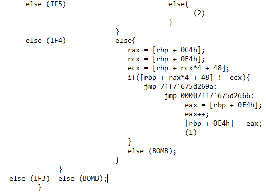

# Phase 6: Danh sách liên kết và Thuật toán sắp xếp 

## 1. Kiểm tra tính hợp lệ của Input
Mở đầu Phase 6, chương trình nạp 6 số nguyên vào một mảng. Ngay sau đó, nó đưa mảng này qua một thuật toán kiểm tra tính hợp lệ và không trùng lặp bằng hai vòng lặp lồng nhau:

*   **Kiểm tra giới hạn (Lớp 1):** Chương trình lấy từng số nhập vào so sánh với 1 (`cmp ..., 1` và nhảy `jl` vào BOMB) và so sánh với 6 (`cmp ..., 6` và nhảy `jg` vào BOMB). Cụm lệnh này ép buộc toàn bộ các con số bạn nhập phải nằm trong khoảng an toàn từ 1 đến 6.
*   **Kiểm tra trùng lặp (Lớp 2):** Vòng lặp bên trong sẽ lấy số đang xét đem so sánh với các số còn lại trong mảng bằng lệnh `cmp [rbp+rax*4+48h], ecx`. Lệnh nhảy `jne` (nhảy nếu khác nhau) được dùng để đi tiếp. Nếu hai số bằng nhau, luồng chạy rớt thẳng xuống lệnh gọi nổ bom.

=> **Quy tắc 1:** Chuỗi Input bắt buộc phải là một hoán vị của **1, 2, 3, 4, 5, 6** (6 số duy nhất).

## 2. Truy xuất cấu trúc Struct và Danh sách liên kết
Chương trình nạp một địa chỉ cố định vào bộ nhớ, ở đây là biến `node1` có địa chỉ `00007ff7'675df050`.

Khi soi vùng nhớ này bằng lệnh `dd` trong trình gỡ lỗi, ta phát hiện một Danh sách liên kết được tạo từ một `struct` có kích thước 16 byte.

Cấu trúc của nó bao gồm:
*   `+0x0` (4 byte): Giá trị thực dùng để so sánh.
*   `+0x4` (4 byte): Số thứ tự của Node (từ 1 đến 6).
*   `+0x8` (8 byte): Con trỏ lưu địa chỉ của Node tiếp theo.

Sử dụng trình gỡ lỗi để xuất toàn bộ 6 Node này ra, ta thu được danh sách các Giá trị và Số thứ tự tương ứng.

Dựa vào ảnh xuất bộ nhớ trên, ta có thể dịch các giá trị từ hệ Hex sang hệ Thập phân như sau:
*   **Node 1:** Giá trị = `0x212` = **530**
*   **Node 2:** Giá trị = `0x1c2` = **450**
*   **Node 3:** Giá trị = `0x215` = **533**
*   **Node 4:** Giá trị = `0x393` = **915**
*   **Node 5:** Giá trị = `0x3a7` = **935**
*   **Node 6:** Giá trị = `0x200` = **512**

## 3. Quá trình Tái cấu trúc và Điều kiện chốt hạ
Luồng thực thi ở nửa cuối Phase 6 hoạt động theo 3 bước:

1.  **Duyệt và gom Node:** Vòng lặp sử dụng chính các con số ta nhập vào để làm số thứ tự tìm kiếm. Dựa vào thao tác duyệt `node = node->next` (được thể hiện rõ qua lệnh lấy con trỏ `mov rax, [rax + 8]`), chương trình sẽ lùi từng bước để bắt đúng Node bạn chỉ định và cất nó vào một mảng tạm.

2.  **Tái cấu trúc (Nối dây lại):** Khi đã gom đủ 6 Node theo đúng thứ tự bạn nhập, chương trình chạy một vòng lặp để lấy đuôi của Node trước trỏ vào đầu của Node sau (`mov [rcx + 8], rax`). Thao tác này đập bỏ hoàn toàn danh sách cũ và xâu chuỗi chúng lại thành một Danh sách liên kết mới toanh.
3.  **Điều kiện phá bom:** Vòng lặp cuối cùng sẽ đi dọc theo danh sách mới này để kiểm tra chốt hạ bằng lệnh `cmp [rcx], eax` (so sánh Giá trị của Node trước với Node sau). Lệnh nhảy `jge` (nhảy nếu lớn hơn hoặc bằng) bắt buộc điều kiện này phải luôn đúng để qua cửa.

=> **Quy tắc 2:** Danh sách liên kết mới bắt buộc phải được sắp xếp theo thứ tự **GIẢM DẦN**.

## 4. Chốt đáp án
Từ dữ liệu xuất bộ nhớ ở Mục 2, ta sắp xếp 6 Giá trị theo thứ tự từ lớn nhất đến nhỏ nhất:
**935** > **915** > **533** > **530** > **512** > **450**

Ánh xạ ngược lại với Số thứ tự ban đầu của các Node này, ta thu được con đường duy nhất để gỡ mìn:
**5 -> 4 -> 3 -> 1 -> 6 -> 2**

👉 **Đáp án (Phase 6):** `5 4 3 1 6 2`

## 🕵️‍♂️ Phụ lục:
Dịch ngược các vòng lặp lồng nhau từ Assembly ra mã C, bạn có thể xem các bản phân tích nháp (raw notes) của tôi tại đây:
*   [📝 Phân tích mã giả và vòng lặp Phase 6](./phase6.txt)
