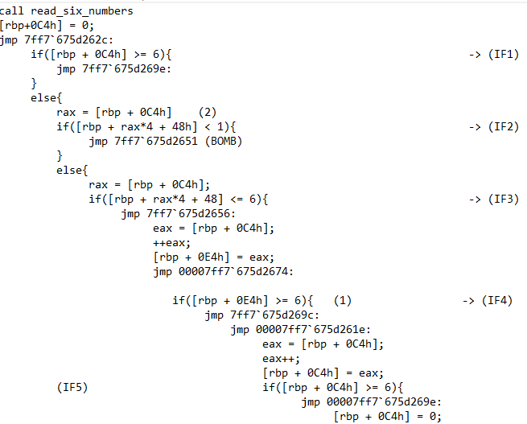
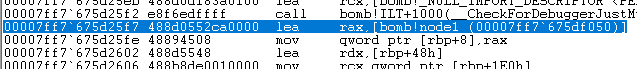
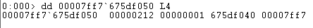
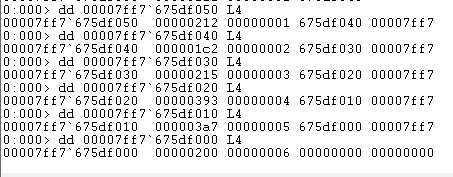
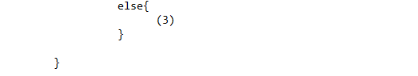
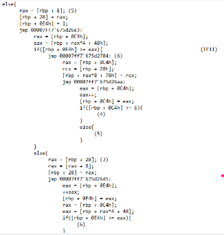
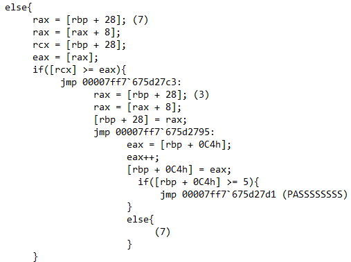

# Phase 6: Linked List & Sorting (Trùm cuối)

## 1. Kiểm tra tính hợp lệ của Input (Uniqueness Check)
Mở đầu Phase 6, chương trình nạp 6 số nguyên vào một mảng. Ngay sau đó, nó đưa mảng này qua một thuật toán kiểm tra trùng lặp với 2 vòng lặp `for` lồng nhau (được biểu diễn qua các khối nhảy điều kiện của Assembly).

*   **Lớp thứ nhất:** Đảm bảo từng số nhập vào phải thỏa mãn điều kiện `1 <= input[i] <= 6`.
*   **Lớp thứ hai:** Lấy số đang xét so sánh với các số còn lại. Nếu phát hiện 2 số bằng nhau $\rightarrow$ BOMB.

=> **Quy tắc 1:** Chuỗi Input bắt buộc phải là một hoán vị của **1, 2, 3, 4, 5, 6** (6 số duy nhất).

## 2. Truy xuất cấu trúc Struct và Linked List
Chương trình nạp một địa chỉ cố định vào bộ nhớ, ở đây là biến `node1` có địa chỉ `00007ff7'675df050`.

Khi soi vùng nhớ này bằng lệnh `dd` trong Debugger, ta phát hiện một **Danh sách liên kết (Linked List)** được tạo từ một `struct` 16 bytes.

Cấu trúc của nó bao gồm:
*   `+0x0` (4 bytes): Giá trị thực (Value) để so sánh.
*   `+0x4` (4 bytes): Số thứ tự Node (từ 1 đến 6).
*   `+0x8` (8 bytes): Con trỏ tới địa chỉ của Node tiếp theo.

Sử dụng Debugger để Dump toàn bộ 6 Node này ra, ta thu được danh sách các Giá trị (Value) và Số thứ tự (ID) tương ứng.

Dựa vào ảnh dump bộ nhớ trên, ta có thể dịch các giá trị từ hệ Hex sang hệ Thập phân (Decimal) như sau:
*   **Node 1:** Value = `0x212` = **530**
*   **Node 2:** Value = `0x1c2` = **450**
*   **Node 3:** Value = `0x215` = **533**
*   **Node 4:** Value = `0x393` = **915**
*   **Node 5:** Value = `0x3a7` = **935**
*   **Node 6:** Value = `0x200` = **512**

## 3. Quá trình Tái cấu trúc và Điều kiện chốt hạ
Luồng thực thi ở nửa cuối Phase 6 hoạt động theo 3 bước:

1.  **Duyệt và gom Node:** Vòng lặp sử dụng chính các con số ta nhập vào làm `id` để tìm Node. Bằng thao tác duyệt `node = node->next` (Khối 3), chương trình lặp để bắt đúng Node và lưu "chuyển nhà" vào một mảng tạm.

2.  **Tái cấu trúc (Re-linking):** Nó xâu chuỗi 6 Node trong mảng tạm lại với nhau thành một Linked List hoàn toàn mới.
3.  **Điều kiện phá bom:** Vòng lặp cuối cùng sẽ duyệt cái Linked List mới này và thực hiện lệnh kiểm tra: `if (node->val < node->next->val) explode_bomb()` (được dịch từ lệnh `cmp [rcx], eax` và `jge`).

=> **Quy tắc 2:** Danh sách liên kết mới bắt buộc phải được sắp xếp theo thứ tự **GIẢM DẦN (Descending Order)**.

## 4. Chốt đáp án
Từ dữ liệu Memory Dump ở Mục 2, ta sắp xếp 6 giá trị Value theo thứ tự từ lớn nhất đến nhỏ nhất:
**935** > **915** > **533** > **530** > **512** > **450**

Ánh xạ ngược lại với Số thứ tự ban đầu (ID) của các Node này, ta thu được đường đi duy nhất để phá bom:
**5 $\rightarrow$ 4 $\rightarrow$ 3 $\rightarrow$ 1 $\rightarrow$ 6 $\rightarrow$ 2**

👉 **Answer (Phase 6):** `5 4 3 1 6 2`
