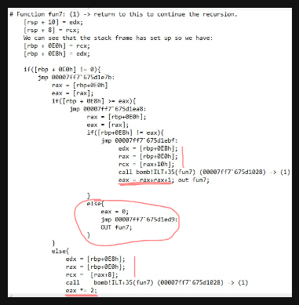
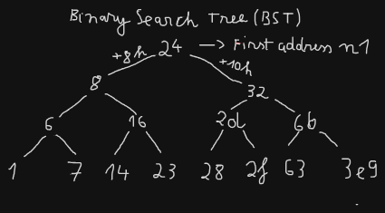
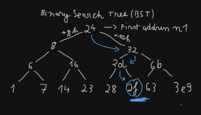

# Secret Phase

## A. Search for the call to `secret_phase`

Normally, after solving a phase, the program will call the `phase_defused` function.
At first, we might think that `phase_defused` is simply called to display a message telling us that the phase has been successfully defused.
However, if we go inside `phase_defused` and scroll further down, we discover something interesting:

`call bomb!ILT+475(secret_phase)`

This is where `secret_phase` is called.
The problem is that **we have never been able to trigger `secret_phase`.**
→ Therefore, instead of analyzing `secret_phase` directly, we need to go back and analyze **the condition that allows `phase_defused` to call `secret_phase`.**

### A.1. Analyzing the conditions inside `phase_defused`

First, the program checks whether we have successfully defused all **6 phases**.
If we have not completed all 6 phases yet, the program jumps out of `phase_defused` and continues with the other phases.

Then, at the address `00007ff7'675d2cd1`, we encounter the instruction: `lea rcx, [bomb!input_strings]`

When we inspect the address pointed to by `rcx`, we can see that it contains the **answer string we entered for phase 1**.
Next, the program performs an addition: `rcx += rax`.

After checking `rcx` again, we discover that it has moved to the address containing the **answer string for phase 4**.
→ This shows that the program is using the input from **phase 4** for a special check.

### A.2. Discovering the special format of phase 4

At the address `00007ff7'675d2cf2`, we encounter: `lea rdx, [bomb!string]`
Inspecting the string at this address, we discover the following format: 

`"%d %d %s"`

This is particularly interesting.
Normally, in phase 4, we only enter **two numbers**.
However, the format `%d %d %s` requires:

`integer + integer + string`

→ **This shows that the phase 4 input can contain an additional string after the two numbers.**

### A.3. Analyzing `sscanf`

Next, the program calls `sscanf(...)` to check whether our input matches the format `%d %d %s`.
At the address `00007ff7`675d2d10`, we once again see `rdx` being assigned an address through:

`lea rdx, [bomb!string]`

Inspecting the string at this address, we find: `DrEvil`
Immediately afterward, `rcx` is assigned another address.
When we inspect the value pointed to by `rcx`, we can see that it contains the **string — the third argument in our input**.

## A.4. The condition for triggering `secret_phase`

The program then performs a comparison to check whether: `input_string == "DrEvil"`

If the input string is **not `DrEvil`**, the program jumps to `00007ff7'675d2d41` and we will never reach: `call secret_phase`

### → Conclusion

To trigger `secret_phase`, the input for **phase 4** must have the following format:

`<number> <number> DrEvil`

In this case, the answer for phase 4 is: `3 10 DrEvil`

→ **`3 10 DrEvil` is the condition required for the program to enter `secret_phase`.**

---

## B. Inside the function secret_phase!!!!
skipping the stack initialization, we move to the instructions after `call bomb!ILT+1000(__CheckForDebuggerJustMyCode)`.

First, the program calls `read_line` to read the seventh line of input as a string. The function returns the address of this string in `RAX`, which is then stored at `[rbp+8]`.
Next, the program sets `RCX = [rbp+8]` to pass the string's address as an argument to `atoi` (ASCII to Integer).
Finally, atoi converts the numeric string into an integer and returns the result in EAX. The program then stores this value at [rbp+24].

Next, the program compares `[rbp+24]` with `1`. If the value is less than `1`, the bomb will explode. Therefore, our input must be greater than or equal to `1`.
In the next branch, `[rbp+24]` is compared with `3E9h` (1001 in decimal). If the value exceeds this limit, the bomb will also explode.

→ This means our input must be within the range `[1, 1001]`.

After passing these checks, the program prepares two arguments for the `fun7` function:

- `EDX = [rbp+24]`: Contains the integer value we entered.
- `RCX = &n1`: Contains the address of `n1` (`00007ff7'675df1b0`), obtained through the `lea` instruction.

When we inspect the memory at this address, we find the value 24h (36 in decimal). 
However, we still don't know exactly what n1 represents. It might be the first element of an array or part of some other data structure.
Finally, the program calls `fun7`. Once the function returns, its result is stored in `EAX`.
The program then checks whether `EAX == 5`.

- If `EAX == 5`, we pass this check.
- Otherwise, the bomb explodes!

→ Therefore, our next goal is to analyze `fun7` and figure out which input causes it to return `5`.

## C. Analyze fun7 function

When analyzing the `fun7` function, we can see that `EDX` contains our input value, while `RCX` holds the address of what might be an array or some other data structure.
These values are initially stored on the stack at `[rsp+10h]` and `[rsp+8]`, respectively.
After the stack frame is set up, we can see that the same values are accessed through `[rbp+0E8h]` and `[rbp+0E0h]`, respectively.

First, the function checks whether `[rbp+0E0h]` is `NULL`. If it is, the function returns `-1`, ending the current recursive call. This suggests that if our input does not exist in the data structure, we will eventually fail to defuse the bomb.
Next, we can see that `[rbp+0E8h]` stores our input value, which remains unchanged throughout the recursive calls.
The program then compares our input with the value stored in the current node.
Pay attention to the following conditions:

- **If INPUT > node value:** `RCX` receives the pointer stored at `[RAX+10h]`, and `fun7` is called recursively.
- **If INPUT < node value:** `RCX` receives the pointer stored at `[RAX+8h]`, and `fun7` is called recursively.
- **If INPUT == node value:** The function returns `0`, ending the recursion.

Notice that the function also calculates its return value differently depending on which branch is taken:

- Left branch: `EAX = 2 * fun7(...)`
- Right branch: `EAX = 2 * fun7(...) + 1`

→ Based on these observations, we can conclude that the initial address stored in `RCX` points to the **root node of a Binary Search Tree (BST)**.

Our goal is to find a value in this tree that causes `fun7` to return `5`.

### C.1. Reconstructing the Binary Search Tree

Starting from the initial address stored in `RCX`, we can reconstruct the entire BST by following the pointers to its left and right child nodes.
Each node contains a value and two pointers:

- `[node+8h]`: Pointer to the left child.
- `[node+10h]`: Pointer to the right child.

When both pointers are `NULL`, we have reached a **leaf node**, meaning there are no more child nodes to explore.
By examining these addresses one by one, we can reconstruct the following tree:

→ Now that we have reconstructed the BST, the next step is to determine which path produces the required return value: **`EAX = 5`**.

### C.2. Finding the correct input
To make `EAX = 5`, let's take another look at how the return value is calculated:

- **Right branch:** `EAX = EAX * 2 + 1`
- **Left branch:** `EAX = EAX * 2`

Since we have already reconstructed the entire BST, finding the correct path should be pretty easy now, right? :>
Starting from the root, we follow this path:

**Right → Left → Right**

When the target node is found, `fun7` returns `0`. As the recursive calls return, the result is calculated in reverse order:

- Right: `0 * 2 + 1 = 1`
- Left: `1 * 2 = 2`
- Right: `2 * 2 + 1 = 5`

→ **Finally, we have found the correct input: `2Fh = 47` in decimal!**

## D. Final Result — Bomb Defused!

After entering `47`, we successfully trigger the final condition and defuse the secret phase!

**Congratulations! We've successfully defused the entire bomb, including the secret phase!**

And that's the end of our Bomb Lab journey! :>
