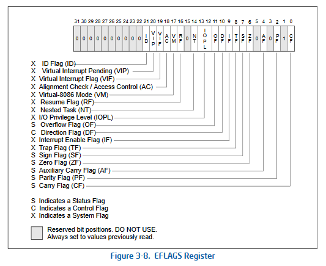

# OpenSecurityTraining2 Arch1001: Lab RTFM & WTFI!

## Challenge Description

Trong thử thách này, chúng ta được yêu cầu viết trực tiếp mã máy thô (raw bytecode) bằng chỉ thị `db` để tạo ra chuỗi lệnh Assembly sau:

```assembly
mov eax, 0xAABBCCDD
sahf
jz mylabel
and eax, 0x31337
mylabel:
ret
```

## Read the F*n Intel Manual

Trong bộ tài liệu *Intel® 64 and IA-32 Architectures Software Developer’s Manual* [[1]](https://www.intel.com/content/www/us/en/developer/articles/technical/intel-sdm.html), mã máy (object code / opcode) cho từng câu lệnh Assembly đều được quy định cụ thể. Mã opcode này chính là biểu diễn dưới dạng hệ thập lục phân (hexadecimal) của các câu lệnh Assembly dạng chữ (human-readable), giúp vi xử lý có thể giải mã và thực thi trực tiếp. Ví dụ, câu lệnh `RET` được biểu diễn bởi mã opcode là `C3`.

---

### 1. `mov eax, 0xAABBCCDD`

Tra cứu bảng lệnh `MOV` trong Intel SDM, ta sử dụng cấu trúc `MOV r32, imm32` có mã opcode là `B8+ rd id`:


* Ký hiệu `+rd` cộng thêm mã định danh của thanh ghi 32-bit đích (theo *Table 3-1*, thanh ghi `EAX` có mã bằng `0`), do đó byte opcode đầu tiên là `B8 + 0 = 0B8h`.
* Ký hiệu `id` là giá trị tức thời 4-byte (`0xAABBCCDD`). Do kiến trúc x86-64 lưu trữ dữ liệu theo chuẩn **Little-Endian** (byte thấp đứng trước, byte cao đứng sau), `0xAABBCCDD` được viết thành `0DDh, 0CCh, 0BBh, 0AAh`.

👉 **Bytecode:** `db 0B8h, 0DDh, 0CCh, 0BBh, 0AAh`

---

### 2. `sahf`

Lệnh `SAHF` (*Store AH Into Flags*) có mã opcode gồm 1 byte duy nhất là `9Eh`. Lệnh này nạp trực tiếp các bit từ thanh ghi `AH` vào các cờ trạng thái tương ứng trong thanh ghi `EFLAGS`.

Ở bước trước, giá trị `0xAABBCCDD` đã được nạp vào `EAX` (`AX = 0xCCDD`), vì vậy thanh ghi `AH` mang giá trị `0xCC` (`BIN = 1100 1100`). Các bit của `AH` (`1100 1100`) được nạp thẳng vào thanh ghi `EFLAGS`. Do đó, đối chiếu với sơ đồ thanh ghi `EFLAGS` bên dưới, các cờ `PF` (Parity - bit 2), `ZF` (Zero - bit 6) và `SF` (Sign - bit 7) đều được bật lên `1`:



*(Ví dụ: Bit 2 của `1100 1100` bằng `1` nên cờ Parity `PF` được bật; Bit 6 của `1100 1100` bằng `1` nên cờ Zero `ZF` được bật)*.

👉 **Bytecode:** `db 9Eh`

---

### 3. `jz mylabel` & `and eax, 0x31337`

Tra cứu bảng lệnh `Jcc`, lệnh nhảy ngắn `JZ rel8` (nhảy nếu cờ `ZF = 1`) có mã opcode là `74 cb`:


* Byte đầu tiên là `74h`. Byte thứ hai (`cb`) là khoảng cách nhảy tương đối 1-byte tính từ lệnh kế tiếp sau `jz` tới vị trí nhãn `mylabel:`.
* Để tính được `cb`, trước hết ta phải xác định độ dài byte của câu lệnh nằm giữa là `and eax, 0x31337`:
  * Lệnh `AND EAX, imm32` có mã opcode là `25 id`.
  * Biểu diễn `0x00031337` (đủ 4 bytes cho `id`) theo thứ tự Little-Endian là `37h, 13h, 03h, 00h`.
  * Do đó, lệnh `and eax, 0x31337` được mã hóa thành `db 25h, 37h, 13h, 03h, 00h` và chiếm tổng cộng **5 bytes (`5h`)**.
* Vì cần nhảy vượt qua 5 bytes của lệnh `and` để tới thẳng nhãn `mylabel:` (ngay trước lệnh `ret`), giá trị `cb` của lệnh `jz` là `5h`.

👉 **Bytecode (`jz`):** `db 74h, 5h`  
👉 **Bytecode (`and`):** `db 25h, 37h, 13h, 03h, 00h`

---

### 4. `ret`

Lệnh `RET` (Near return) có mã opcode là `C3`.

👉 **Bytecode:** `db 0C3h`

---

## Final Assembly & Execution Result

Tổng hợp toàn bộ chuỗi bytecode trong file [`raw_bytecode.asm`](./raw_bytecode.asm):

```assembly
PUBLIC asm_scratchpad

.code
asm_scratchpad PROC
    ;code goes here
    db 0B8h, 0DDh, 0CCh, 0BBh, 0AAh
    db 9Eh
    db 74h, 5h
    db 25h, 37h, 13h, 03h, 00h
    db 0C3h
asm_scratchpad ENDP
end
```

Khi biên dịch và kiểm tra trên cửa sổ **Disassembly** của Visual Studio, các byte thô đã được dịch ngược chính xác thành chuỗi lệnh mục tiêu. Đồng thời, do cờ `ZF = 1` (được thiết lập bởi lệnh `sahf`), lệnh `je` (`jz`) thực hiện nhảy qua lệnh `and eax, 31337h` tới thẳng lệnh `ret`, giữ nguyên giá trị `0xAABBCCDD` trong thanh ghi `EAX`:


---

## References
* **[1]** [Intel® 64 and IA-32 Architectures Software Developer Manuals](https://www.intel.com/content/www/us/en/developer/articles/technical/intel-sdm.html)
* **[2]** [OpenSecurityTraining2: Architecture 1001: x86-64 Assembly](https://ost2.fyi/Arch1001)
